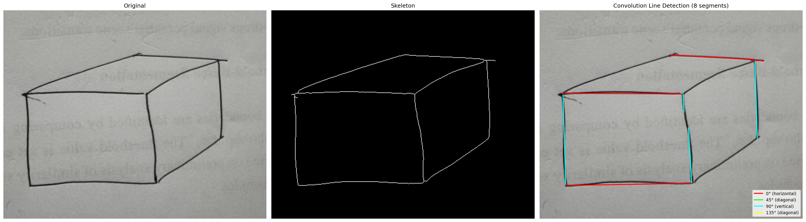

# Cuboid Line Detection using Sequential RANSAC

Detects structural lines of a hand-drawn cuboid from an image using Sequential RANSAC on skeletonized edge pixels, with corner snapping post-processing.

## Pipeline

1. **Adaptive Mean Threshold** → binarize hand-drawn strokes
2. **Morphological Cleaning** → remove noise and small components
3. **Skeletonize** → reduce strokes to 1-pixel-wide lines
4. **Sequential RANSAC** → iteratively fit lines with gap detection
5. **Corner Snapping** → force nearby endpoints to exact intersection points

## Results

### Main Pipeline — Sequential RANSAC with Corner Snapping
**Notebook:** `ransac_cuboid_detection.ipynb`

Adaptive threshold → skeletonize → sequential RANSAC (gap detection) → corner snapping.


---

### Convolution with Directional Kernels
**Notebook:** `method_convolution.ipynb`

Adaptive threshold → skeletonize → convolve with oriented line kernels (0°, 45°, 90°, 135°) → extract segments per direction.



---

> **Note:** Results are not perfect — this is a work in progress with continuous fixes and improvements.

## Usage

```bash
pip install opencv-python numpy matplotlib scikit-image
jupyter notebook ransac_cuboid_detection.ipynb
```

Place your image as `cuboid.png` in the same directory and run all cells. Each `method*.ipynb` notebook is self-contained and can be run independently.
