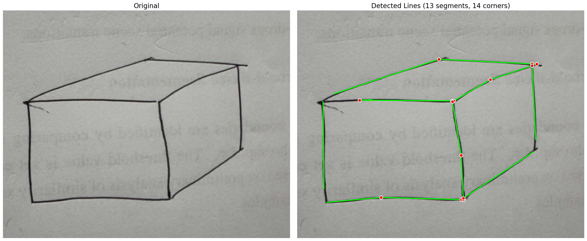
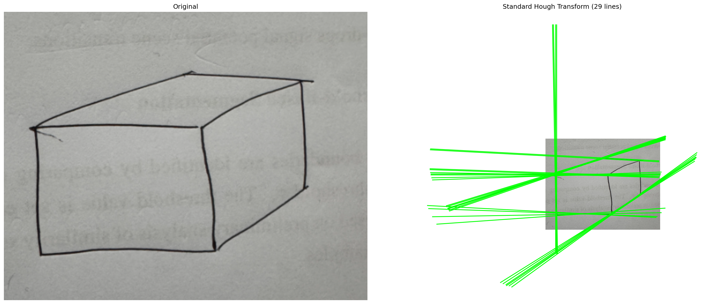
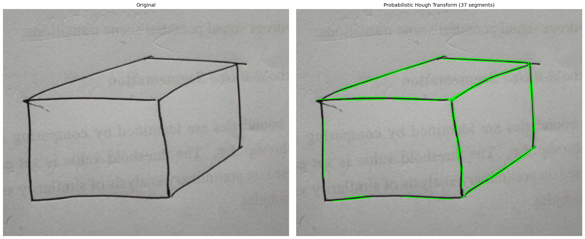
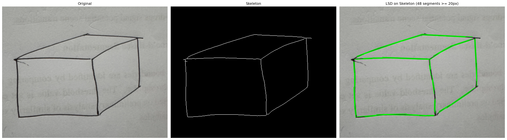
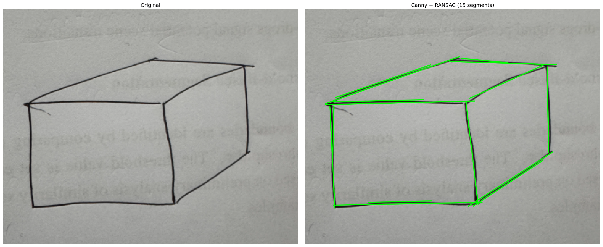
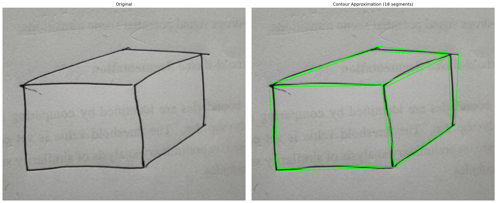

# Cuboid Line Detection using Sequential RANSAC

Detects structural lines of a hand-drawn cuboid from an image using Sequential RANSAC on skeletonized edge pixels, with corner snapping post-processing.

## Pipeline

1. **Adaptive Mean Threshold** → binarize hand-drawn strokes
2. **Morphological Cleaning** → remove noise and small components
3. **Skeletonize** → reduce strokes to 1-pixel-wide lines
4. **Sequential RANSAC** → iteratively fit lines with gap detection
5. **Corner Snapping** → force nearby endpoints to exact intersection points

## Results

### Main Pipeline — Sequential RANSAC with Corner Snapping
**Notebook:** `ransac_cuboid_detection.ipynb`

Adaptive threshold → skeletonize → sequential RANSAC (gap detection) → corner snapping.



---

### Method 1 — Standard Hough Transform
**Notebook:** `method1_hough_standard.ipynb`

`cv2.HoughLines` on Canny edges. Detects infinite lines by voting in (ρ, θ) space.



---

### Method 2 — Probabilistic Hough Transform
**Notebook:** `method2_hough_probabilistic.ipynb`

`cv2.HoughLinesP` — outputs finite line segments with `minLineLength` and `maxLineGap` controls.



---

### Method 3 — Line Segment Detector (LSD)
**Notebook:** `method3_lsd.ipynb`

`cv2.createLineSegmentDetector` — gradient-based, parameter-free segment detection.



---

### Method 4 — Canny + Sequential RANSAC
**Notebook:** `method4_canny_ransac.ipynb`

Canny edge detection followed by sequential RANSAC with gap splitting (no skeletonization).



---

### Method 5 — Contour Approximation
**Notebook:** `method5_contour_approx.ipynb`

`cv2.findContours` + `cv2.approxPolyDP` — polygonal approximation of detected contours.



---

> **Note:** Results are not perfect — this is a work in progress with continuous fixes and improvements.

## Usage

```bash
pip install opencv-python numpy matplotlib scikit-image
jupyter notebook ransac_cuboid_detection.ipynb
```

Place your image as `cuboid.png` in the same directory and run all cells. Each `method*.ipynb` notebook is self-contained and can be run independently.
